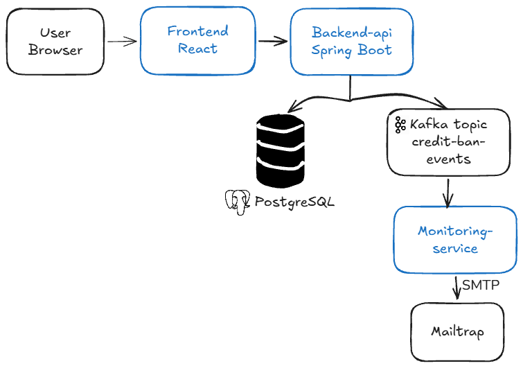

# Credit Register POC

A proof-of-concept system for fetching credit data from the Finnish **Positive Credit Register (PCR)**, with real-time monitoring of **voluntary credit ban** flags and email notifications.

Built as a **microservices-based** application with three main components: a React frontend, a Spring Boot backend, and an event-driven monitoring service connected via Apache Kafka.

---
## Table of Contents

- [Architecture](#architecture)
- [Tech Stack](#tech-stack)
- [Key Features](#key-features)
- [Quick Start (Docker)](#quick-start-docker)
- [Local Development](#local-development)
- [API Endpoints](#api-endpoints)
- [Test Data](#test-data)
- [Error Handling](#error-handling)
- [Testing](#testing)
- [Design Decisions & Trade-offs](#design-decisions--trade-offs)
- [Assumptions](#assumptions)
- [Future Improvements](#future-improvements)
- [Project Structure](#project-structure)

---

## Architecture



**Data flow:**

1. User submits an SSN via the React frontend.
2. Backend API calls a mocked **PCR REST API** to fetch credit data.
3. The response is persisted in **PostgreSQL**.
4. If the response indicates a **voluntary credit ban**, the backend publishes an event to **Kafka**.
5. The **Monitoring Service** consumes the event and sends an **email notification**.

---

## Tech Stack

| Layer | Technology |
|-------|-----------|
| Frontend | React 19, TypeScript, Vite, React Router, Axios |
| Backend | Java 21, Spring Boot 3.2.4, Spring Web, Spring Data JPA |
| Database | PostgreSQL 16 |
| Messaging | Apache Kafka 3.7 (KRaft mode, no ZooKeeper) |
| Monitoring | Spring Boot 3.2.4, Spring Kafka, Spring Mail |
| Testing | JUnit 5, Mockito, MockMvc, MockRestServiceServer |
| Build | Maven, npm |
| Container | Docker, Docker Compose |

---

## Key Features

- Fetch credit extract from a mocked PCR API for a given SSN
- View the full fetch history for any consumer
- Inspect detailed information for each fetch instance
- Persist all fetch attempts (successful, failed, and deceased) in PostgreSQL
- Publish credit-ban events to Kafka for asynchronous processing
- Send email notifications when a voluntary credit ban is detected
- Graceful error handling with standardized API error responses
- Comprehensive test coverage (unit + integration)

---

## Quick Start (Docker)

### Prerequisites

- Docker Desktop (or Docker Engine + Docker Compose v2)
- ~4 GB RAM available for containers

### Run

```bash
git clone <your-repo-url>
cd credit-register-tech-assignment
docker-compose up --build
```

That's it! The services will start in the correct order (PostgreSQL → Kafka → Backend → Monitoring → Frontend).

### Access the application

| Service | URL |
|---------|-----|
| **Frontend** | http://localhost |
| **Backend API** | http://localhost:8080 |
| **Monitoring Service** | http://localhost:8082 |
| **PostgreSQL** | localhost:5432 (user / password) |
| **Kafka** | localhost:9092 |

### Stop

```bash
docker-compose down           # stop containers
docker-compose down -v        # stop and remove volumes (clean slate)
```

---

## Local Development

For faster iteration, you can run each component locally.

### Backend API

```bash
cd backend-api
mvn clean package -DskipTests
mvn spring-boot:run
```

Requires: Java 21, Maven 3.9+, running PostgreSQL and Kafka.
> start only the infrastructure with `docker-compose up -d postgres kafka`.

### Monitoring Service

```bash
cd monitoring-service
mvn clean package -DskipTests
mvn spring-boot:run
```

### Frontend

```bash
cd frontend
npm install
npm run dev
```

Opens on http://localhost:5173. Vite proxies `/api/*` to `http://localhost:8080`.

---

## API Endpoints

### Fetch credit data

```http
POST /api/credit/fetch
Content-Type: application/json

{
  "ssn": "987654-321"
}
```

**Response** (200 OK):

```json
{
  "id": 1,
  "ssn": "987654-321",
  "fetchDate": "2026-09-12T10:15:00",
  "extractReference": "GU-1789027736357",
  "status": "SUCCESS",
  "voluntaryCreditBan": false,
  "banReason": null,
  "lendersCount": 1,
  "loanContractsCount": 2,
  "totalLoanAmount": 24000.00,
  "currencyCode": "EUR"
}
```

### Get fetch history

```http
GET /api/credit/history/{ssn}
```

Returns a list of all fetch attempts for the given SSN, ordered by fetch date (descending).

### Get fetch details

```http
GET /api/credit/details/{id}
```

Returns the full record, including the raw PCR response in `fullResponse` (JSON string).

### List credit bans (internal / debug)

```http
GET /api/credit/internal/credit-bans
```

Returns all records where `voluntaryCreditBan = true`.

The endpoint is retained for debugging:

- Quickly inspect all credit-ban records in the system.
- Serve as a fallback if Kafka is unavailable and the monitoring service needs to reconcile state.
- Enable future admin dashboards or manual audits.

It is **not called by any production service** and does not affect the regular data flow.

---

## Test Data

The mocked PCR API recognizes special SSN patterns:

| SSN Pattern | Scenario | Expected `status` | Notes |
|-------------|----------|-------------------|-------|
| `987654-321` | Successful response, no ban | `SUCCESS` | |
| `777777-777` | Successful response with voluntary credit ban | `SUCCESS` | Triggers Kafka event + email |
| `888888-888` | Deceased consumer | `DECEASED` | `deceasedPerson` in `fullResponse` |
| `999999-999` | PCR validation error | `PCR_ERROR` | `errorResponses` in `fullResponse` |
| `abc` | Invalid SSN format | — | Returns HTTP 400 |

---

## Error Handling

All errors are returned in a standardized JSON format:

```json
{
  "timestamp": "2026-09-12T10:15:00",
  "status": 400,
  "error": "Bad Request",
  "message": "SSN must match format",
  "path": "/api/credit/fetch",
  "errorCode": "INVALID_SSN"
}
```

### Error Codes

| Code | HTTP | Description |
|------|------|-------------|
| `INVALID_SSN` | 400 | SSN is empty or has an invalid format |
| `VALIDATION_ERROR` | 400 | Request body failed `@Valid` validation |
| `MALFORMED_JSON` | 400 | Request body is not valid JSON |
| `TYPE_MISMATCH` | 400 | Path variable has an incorrect type |
| `PCR_VALIDATION_ERROR` | 400 | PCR API rejected the request |
| `CREDIT_EXTRACT_NOT_FOUND` | 404 | No record found for the given ID |
| `PCR_UNAVAILABLE` | 503 | PCR API is unreachable or returned 5xx |
| `INTERNAL_ERROR` | 500 | Unexpected server error |

### Handling philosophy

- **PCR validation errors** (e.g. invalid ID code) are **persisted** as records with `status = PCR_ERROR` — the user can review them in the history. HTTP status is `200 OK`.
- **PCR unavailability** is persisted as `status = SERVICE_ERROR` and returned to the client with HTTP `503`.
- **Kafka send failures do not roll back the database transaction** — the record is saved, the event is logged as lost. For production, an **outbox pattern** is recommended.

---

## Testing

Run all tests:

```bash
cd backend-api && mvn test
cd monitoring-service && mvn test
```

### Coverage

| Test Class | Focus | Count |
|------------|-------|-------|
| `CreditServiceTest` | Business logic (validation, persistence, Kafka trigger) | 12    |
| `PcrClientTest` | HTTP integration with mocked PCR | 2     |
| `CreditControllerTest` | REST endpoints | 7     |


Total: **21 tests**.

---

## Design Decisions & Trade-offs

### Microservices with Kafka 

We chose an event-driven architecture with Kafka over a scheduled polling job:

- Real-time: email notifications are sent immediately, not on the next poll.
- Decoupled: the monitoring service does not access the database or the backend.
- Scalable: multiple consumers can subscribe to the same topic.
- Trade-off: extra infrastructure (Kafka) to maintain. For a production system, this is standard; for a PoC it adds complexity.

### Single-table persistence (vs. normalized schema)

All PCR data is stored in a single `credit_extracts` table:

- Simple, fast, easy to reason about.
- Raw PCR response preserved in `fullResponse` for auditing.
- Trade-off: no normalized access to loans, income, etc. For analytics, a normalized schema would be better.

### Mock PCR embedded in backend (vs. separate service)

The mocked PCR API is a Spring `@RestController` inside the backend service:

- No extra container, zero configuration.
- Easy to change test scenarios.
- Trade-off: not a truly independent service. In production, the real PCR API would be a separate system.

### Record statuses (SUCCESS / PCR_ERROR / DECEASED / SERVICE_ERROR)

Instead of throwing exceptions for every PCR error, we persist all attempts:

- Full audit trail of every PCR call.
- Users can inspect failed attempts from the history page.
- Matches banking-domain requirements (traceability).
- Trade-off: the `credit_extracts` table contains more rows.

### No authentication

For the scope of this assignment, authentication and authorization were **intentionally omitted**. In production, all endpoints would require OAuth2 / JWT.

---

## Assumptions

1. The **PCR API contract** is fixed as described in the assignment (request / success / error / deceased responses).
2. Only one PCR environment is used (`Test`).
3. All SSNs are **Finnish personal identity codes**, but validation is intentionally lenient for the PoC.
4. Email is sent to a **single recipient** (`pcr_monitoring@dansketest.dk`) — no user-configurable subscriptions.
5. The monitoring service processes events **at-least-once**. Duplicate emails are acceptable for the PoC.
6. Kafka is deployed as a **single-broker cluster** (KRaft, no replication).

---

## Future Improvements

- **Outbox pattern** for guaranteed Kafka delivery (no lost events on broker downtime).
- **Idempotent consumer** in the monitoring service (deduplication by `extractReference`).
- **Normalized schema** for loans and income (enables analytics).
- **OAuth2 / JWT** authentication for API endpoints.
- **Dead-letter queue** for Kafka messages that fail repeatedly.
- **Real PCR integration** instead of the mock.
- **Frontend tests** with React Testing Library.
- **Metrics & tracing** with Micrometer + OpenTelemetry.
- **CI/CD** with GitHub Actions (build, test, Docker push).

---

## Project Structure

```
credit-register-tech-assignment/
├── backend-api/                    # Spring Boot backend + mock PCR
│   ├── src/main/java/com/example/backend/
│   │   ├── client/                 # PcrClient (HTTP integration)
│   │   ├── config/                 # Kafka producer config
│   │   ├── controller/             # REST controllers + mock PCR
│   │   ├── dto/                    # Request/response DTOs
│   │   ├── entity/                 # JPA entities
│   │   ├── exception/              # Custom exceptions + handler
│   │   ├── repository/             # Spring Data repositories
│   │   └── service/                # Business logic + Kafka sender
│   └── src/test/java/...           # JUnit + Mockito tests
│
├── monitoring-service/             # Kafka consumer + email sender
│   └── src/main/java/com/example/monitoring/
│       ├── consumer/               # CreditBanConsumer
│       ├── dto/                    # CreditBanEvent
│       └── service/                # EmailService
│
├── frontend/                       # React + TypeScript + Vite
│   ├── src/
│   │   ├── api/                    # Axios client
│   │   ├── components/             # Layout
│   │   ├── pages/                  # Fetch / History / Details
│   │   └── types/                  # TypeScript types
│   ├── Dockerfile
│   └── nginx.conf
│
├── docker-compose.yml              # Orchestration of all services
└── README.md                       # This file
```

---
## Video Walkthrough

A 5-minute walkthrough of the solution is available here: [google-drive](https://drive.google.com/file/d/1RAZWfz4aRMNyC3K1HrxdBDY5B4H8YLnF/view?usp=sharing)
